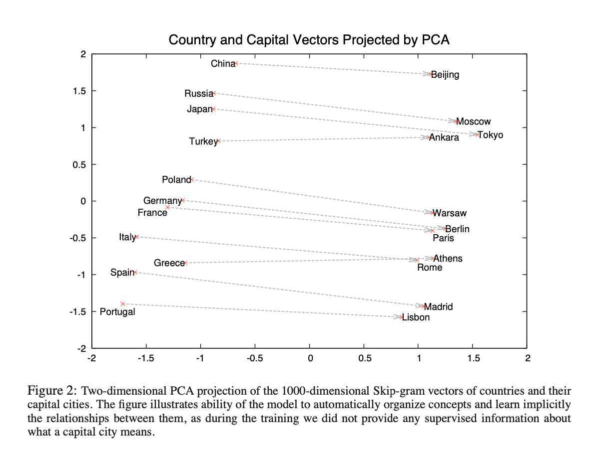
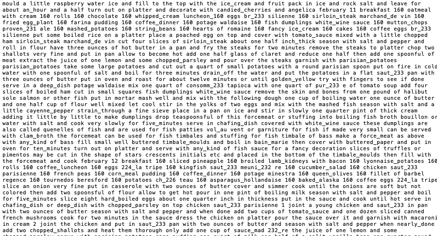

```r
library(devtools)
library(tm)
install_github("bmschmidt/wordVectors") # yup install from GitHub
library(wordVectors)
```


# Word Embeddings
The goal is to convert words into vectors of numbers such that math on the vectors makes sense as math on the words.  The classic examples are things like _king_ - _man_ + _woman_ = _queen_  or _Paris_ - _France_ + _Canada_ = _Ottawa_ or   _Winning_ - _Ottawa_ + _Toronto_ = _Leafs_ 

The concept is to use a model to predict a word from those around it (or the inverse: predict surrounding words from a central word).  The process converts vector(s) of dummy variable encoded words into a low dimensional subspace called an embedding dimension.  This low dimensional embedding  space allows us to do this sort of vector math on words.


 The original paper included two strategies.  Borrowing a figure from that paper:


Tomas Mikolov, Kai Chen, Greg Corrado, Jeffrey Dean (2013)
["Efficient Estimation of Word Representations in Vector Space"](https://arxiv.org/pdf/1301.3781.pdf). ICLR

For a vocabulary of size $V$ which could be $10^6$ish, consider the current word $w(t)$ at position $t$.  From this figure, the continuous bag of Words (CBOW) model uses a window around a central word (here the window is of size 2) and fits a neural network to these 4 input vectors, each of which is zero everywhere except takes a value of 1 in the location corresponding to the word it represents.  The neural network combines these four vectors into a single hidden layer vector of with length $H<<V$.  This hidden layer is combined through an additional transformation to produce an output, here a single vector of length $V$ of probabilities for the central word.
 
The Skip-gram model is the opposite, taking a single one-hot encoded vector of length $V$ as an input to the hidden layer.  The hidden layer outputs 4 vectors of length $V$, each with probabilities for the words in positions within the window.


Borrowing a figure from the second paper from the same group in 2013, vector differences in the hidden layer seem to represent the right kind of behaviour when comparing many countries with their capitals.

Mikolov et al, (2013)"[Distributed Representations of Words and Phrases and their Compositionality](https://papers.nips.cc/paper/5021-distributed-representations-of-words-and-phrases-and-their-compositionality.pdf)" NeuIPS.




The hidden layer embedding of dimension $H$ provides a low dimensional representation where words used in similar ways appear to be 'close' together.  The skipgram representation is a conversion of a word into vector.  We typically measure closeness between vectors via angular (cosine) distance, where, for vectors A, B with components $A_i$, $B_i$, the distance between them is

\[cos(\theta)=\frac{\sum_{i=1}^{N}A_iB_i}{\sqrt{\sum_{i=1}^NA^2_i}\sqrt{\sum_{i=1}^NB^2_i}}.\]
Closeness scores are 1 if the words are exactly the same, 0 if orthogonal, and -1 if exactly opposite.  One problem is that sometimes antonyms are used in similar ways which would give them high similarity.  For example "I love this _kale_, it's delicious!" vs "I love this _donut_, it's delicious!"


# Model Fitting

To be honest, model fitting is slow for a large vocabulary and large text corpus.  Considering the skip-gram architecture for clarity, we typically train such a model by maximizing the average log probability of the observed output words in a window of size $c$ over all central words in position $t\in 1,...,T$,
\[\frac{1}{T}\sum_{t=1}^T\sum_{-c\leq j\leq c, j\not=0} log p(w_{t+j}\mid w_t).\]

The original paper published their [fitted model](https://code.google.com/p/word2vec), but the model is ~3.64GB, and takes several minutes to load into R.  

Consequently we will use a much smaller corpus and fit our own model.  I haven't seen much of a difference between CBOW and skipgram in practice.  

The workhorse library _wordVectors_ is a wrapper to the Google code.  The main function:

- *train_word2vec*(*text_to_model*,*name_of_output_file*,
        vectors=*Embedding_Dimension*,threads=*CPU_cores_to_use*,            
            cbow=*binary_logical_1_->_for_CBOW_0_for_skipgram*,window=*Window_width*,
              iter=*Times_the_algorithm_passes_through_entire_corpus*,negative_samples=*This_is_complex_see_below*) 
      
      
When fitting the model, the training must pass over the entire corpus to update parts of the neural network associated with the observed window of data.  The vast majority of the vocabulary is obviously not contained in the short window and is considered a negative (not present) observation.  You could update parts of the neural net for the entire corpus for each observed word, or you could just update a random sample taken to be a small number of vocabulary elements. This number of words to update is the _negative samples_ input.  Typically for a very large corpus we keep this around 2 or 5 since there are many other opportunities to update the model and larger numbers take longer to run, but for a smaller corpus we often increase to something like 10 or 15.  Results are generally quite robust to this number.  On a realted note, with a large corpus, we typically use a smaller number of iterations since each pass through the corpus has a lot of training examples.


As an example we will use a small corpus, the cookbooks example from _vignette("introduction", "wordVectors")_.  The corpus includes 76 texts from Michigan State University library spanning late 18th to early 20th century.  This corpus is a set of $T\approx$ 1 million words with a vocabulary size of $V$ = 45,820.  We will use a window of size 12.  We are using iter = 5 passes through the corpus for the sake of time, but I would prefer to increase that to 10 or 20.


If you need to download the cookbooks do so [here](http://archive.lib.msu.edu/dinfo/feedingamerica/cookbook_text.zip).  Unzip the file and move it to your working directory.


```r
# takes me about 2:15 to run

T1 = Sys.time()
model = train_word2vec("content/post/cookbooks.txt","content/post/cookbook_vectors.bin",
                       vectors=200,threads=4,cbow=1,window=12,iter=5,negative_samples=7)
                       
T2 = Sys.time()                       

(Elapsed = T2-T1)
```



Words are used in complex ways and often a word changes meaning drastically when considering it as a pair of words, for example [ _Parliament_ ](https://genius.com/artists/Parliament) vs [ _Parliament Hill_ ](https://visit.parl.ca/sites/Visit/default/en_CA).  In the cookbook data we have such compounds like _white_wine_,  _lyonnaise_potatoes_, and _string_beans_.  You can automatically produce such groupings by skimming documents to find word pairs that occur frequently and then 'glueing' them together.  The function _wordVectors::word2phrase_ let's you set thresholds for how frequently words co-occur before they are joined.  It is impossible to separate data cleaning from data analysis.  Here the phrasing also created beasts like _coffee_dinner_ and _coffee_luncheon_.


## Distance between words

It might be of interest to see what words the embedding space places close to others.  Some examples are very succesful and may suggest alternative ingredients.


```r
model %>% closest_to("fish")

model %>% closest_to("peach")

model %>% closest_to("cinnamon")

model %>% closest_to("sweet")

model %>% closest_to("coffee_luncheon")

model %>% closest_to("coffee_dinner")

model %>% closest_to("squirrel")

model %>% closest_to("woman")

model %>% closest_to("man")

```
 
 ## Analogues
 
 _Fish_ is to _dumpling_ as _apple_ is to?  These analogues make a standard test for the quality of the Word2Vec model.  
 
```r
 
 model %>% closest_to(~"dumpling"-"fish"+"apple",15)
 model %>% closest_to("dumpling",15)
 
```
 
 However, the data input is not exactly representative of the population of use cases for a word.  The sampling bias of building a model based on news articles becomes apparent when the Google model is run (large file takes a long time to load, see above for download).
 
 
 ```r
#load in the google pre-trained model:
# takes about 10 minutes to load
model = read.vectors("content/post/GoogleNews-vectors-negative300.bin")
model
#A VectorSpaceModel object of  3000000  words and  300  vectors


# examine the model for Paris is to France as Tokyo is to?
#runtime is ~ 20 seconds
model %>% closest_to(~ "france" - "paris" + "tokyo")
#(often people speed up the model by removing some of the sparse dimensions...)


# King vector - Man vector + Woman vector is close to what?
#runtime is ~ 20 seconds
model %>% closest_to(~ "king" - "man" + "woman")

# Man is to Computer Programmer as Woman is to?
#runtime is ~ 20 seconds
#i.e. Computer Programmer vector - Man vector + Woman vector is close to what?
model %>% closest_to(~ "computer_programmer" - "man" + "woman")


```
The problem with complex models is that their implications are mysterious and difficult to assess.The gendering of words took 3 years to bring out into the open:

Bolukbasi et al (2016) ["Man is to Computer Programmer as Woman is to Homemaker? Debiasing Word Embeddings"](https://papers.neurips.cc/paper/6228-man-is-to-computer-programmer-as-woman-is-to-homemaker-debiasing-word-embeddings.pdf) NeurIPS
 
 The data used to fit the Google model was a convenience sample and is not representative of the population of ways that words are or should be used.
 
 The problem of removing innapropriate bias is not completely solved but that group worked on post-processing to rotate dimensions that should not be gendered.  This idea of post-processing has also been performed to improve matching with conventional analogies.  Several new versions of Word2Vec are optimized based on matching word probabilities with a penalty placed on deviations from some human determined analogies.
 
 
# Inference, tl;dr we have none yet.
 
 The embeddings could be normalized, in which case the vectors take values on the unit hyper-sphere.  It is tempting to consider a document as a random sample of words.  Replacing the words by their embedding vectors projects, in the case of the Google model, 3,000,000 words onto a 300 dimensional sphere.
 
We might want to then compare 2 documents, as though they were two samples and test the null hypothesis that they are samples from the same distribution. 

The Von Mises - Fisher Distribution is used to describe samples on the unit sphere.  Generally this is used for directional data in $\leq$ 3 dimensions, but it can be used in much higher dimensions.
Observations $x$ on a $p-1$ dimensional sphere from a Von Mises - Fisher distribution with mean direction $\mu$ and concentration around the mean $\kappa$ have density

\[f_p(x,\mu,\kappa)=\frac{\kappa^{p/2-1}}{(2\pi)^{p/2}I_{p/2-1}(\kappa)}(\kappa)exp(\kappa\mu^Tx).\]
The $I_{p/2-1}()$ is a modified Bessel function of the first kind with order $p/2-1$.  


The MLE parameter estimate for the mean direction is the vector sum of all vectors divided by the length of the vector,

\[\hat{\mu}= \frac{\sum_{i=1}^Nx_i}{\mid\mid \sum_{i=1}^Nx_i \mid\mid}.\]

For large $p$, the concentraion parameter MLE is approximated by 

\[\hat{\kappa}\approx\frac{\bar{r}(p-\bar{r}^2)}{1-\bar{r}^2},\]
for average vector
\[\bar{r} = \frac{\mid\mid\sum_i x_i\mid\mid}{n}\]


Hypothesis testing is then ANOVA-ish and scales up to samples from $k$ distributions with hypotheses:
\[H_o:\mu_1=...=\mu_k\]
With alternative $H_a:\mu_i\not=\mu_j$ for at least one pair $(i,j)$.

For k populations with sample sizes $n_1, n_2,…,n_k$ where $n= n_1 + n_2 +…+n_k$ and resultant length $R_i = \mid\mid\sum_{j=1}^{n_i}x_{ij}\mid\mid$ with total resultant length $R = \mid\mid\sum_{i=1}^{k}\sum_{j=1}^{n_i}x_{ij}\mid\mid$ we obtain the test statistic:

\[W = \frac
{(n-k)\left(\sum_{i=1}^kR_i-R\right)}
{(k-1)(n-\sum_{i=1}^kR_i)} \sim F_{(k-1)(p-1), (n-k)(p-1)}\]

In the Google case p was 300.  In a small samples of $n=1000$ total words from $k=2$ groups, we end up with degrees of freedom 299 and 298,402.  Rather than obtaining the test statistic you should just assume that it comes back with a significant result.

*Hypothesis testing remains an open problem, but could be useful for assessing plagerism of ideas or author attribution models.*


# More reading

Using Word2Vec to discover new materials:

Tshitoyan et al (2019) ["Unsupervised word embeddings capture latent knowledge from material science literature"](https://www.nature.com/articles/s41586-019-1335-8), Nature 571, 95-98

A generalization of Word2Vec:

Pennington et al. (2014) ["GloVe: Global Vectors for Word Representation"](https://nlp.stanford.edu/pubs/glove.pdf)
Empirical Methods in Natural Language Processing (EMNLP)


Excellent book on circular statistics.  See Chapter 5 for more options for test statistics on the sphere, but unfortunately it wasn't designed for our massive dimensions

Jammalamadaka, S. Rao., and Ambar Sengupta. (2001) "Topics in Circular Statistics". River Edge, N.J: World Scientific

