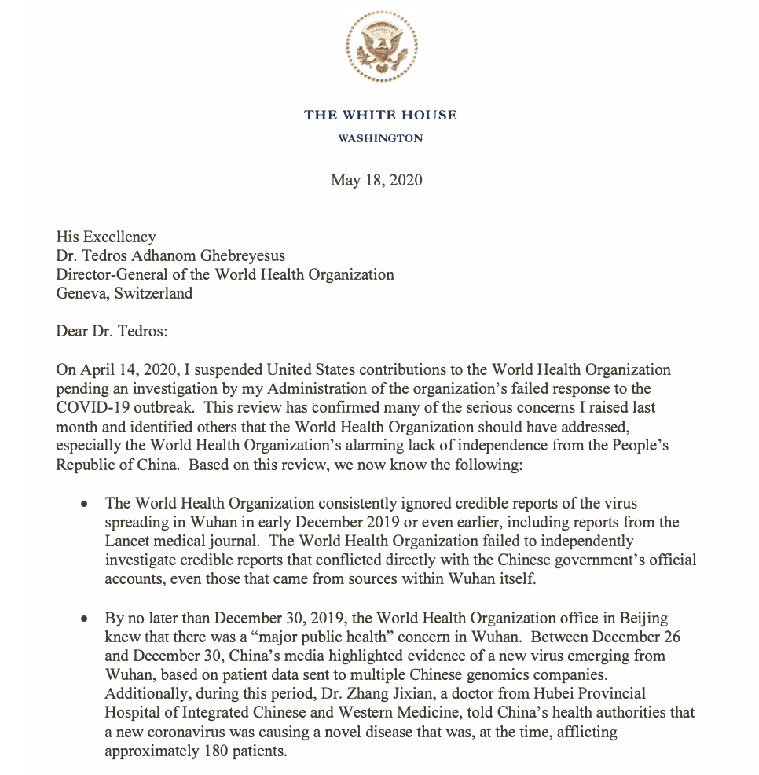
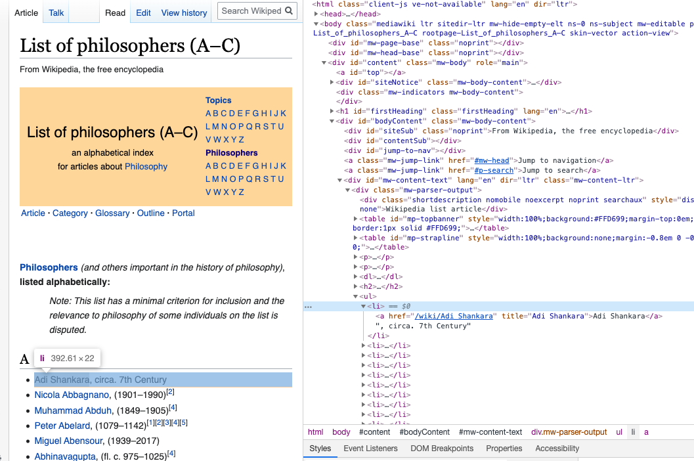
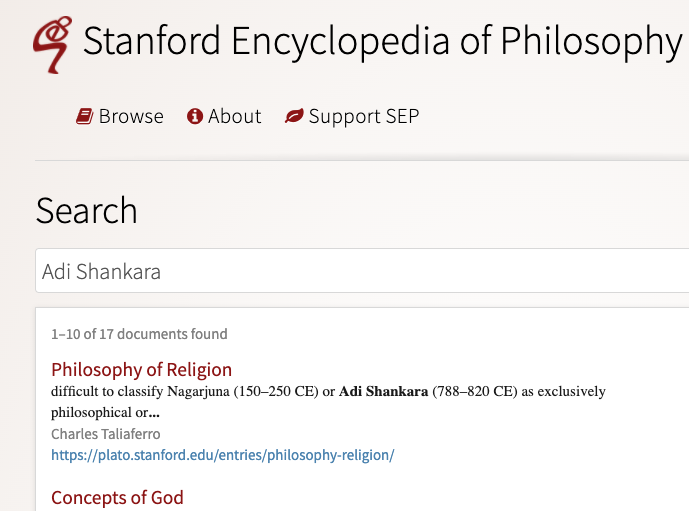
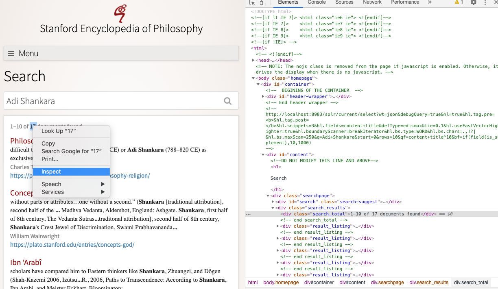

# Outline

- R Libraries for Working with Text
- Importing unstructured text into R: copy/paste, external API, webscraping, R libraries
- Regular expressions and text normalization (e.g., tokenization)
- N-Grams
- Word Vectors and Matricies


```{r setup, include=FALSE}
options(htmltools.dir.version = FALSE, knitr.table.format = "html")
knitr::opts_chunk$set(echo = TRUE, message = FALSE, warning = FALSE)
```


---
class: center, middle

# Introduction

---

# Example 1: Trump's Letter to WHO

.pull-left[
]

.pull-right[
- [Donald Trump's letter](<https://www.whitehouse.gov/wp-content/uploads/2020/05/Tedros-Letter.pdf>) to the Director General of the World Health Organization, Dr. Tedros, is an example of unstructured data.
- There are dates, numbers, and text that does not have a pre-defined data structure.]


---

## Example 2: Analysis of p-values

.pull-left[
]

.pull-right[
>.small[ We defined a P value report as a string starting with either “p,” “P,” “p-value(s),” “P-value(s),” “P value(s),” or “p value(s),” followed by an equality or inequality expression (any combination of =, <, >, ≤, ≥, “less than,” or “of <” and then by a value, which could include also exponential notation (for example, 10-4, 10(-4), E-4, (-4), or e-4).]

]

.midi[p-values were extracted from papers using a regular expression]

---

# Programming Languages for Working With Unstructured Text

- Two popular languages for computing with data are R and Python.

- We chose R for this workshop, but we could have selected Python.

---

## R Libraries for Working with Text

Some very useful R libraries for working with unstructured text that are used in this workshop:

- `base`
- `tidyverse`
- `janitor`
- `tidytext`
- `rvest`
- `RSelenium`


---
class: center, middle

# Importing text into R

---

## Copy/Paste

.pull-left[- For one-time this can work well.

]

.pull-right[.small[
```{r}
tweet_txt <- "I’m starting the week with an 
update on the Canada Emergency Commercial 
Rent Assistance and the work we’re doing 
to get you the support you need. Tune in 
now for the latest:"

tweet_link <- "https://www.cpac.ca/en/programs/covid-19-canada-responds/episodes/66204762/"
tweet_replies <- 164
tweet_rt <- 116
tweet_likes <- 599
tweet_url <- "https://twitter.com/JustinTrudeau/status/1264939872055431168?s=20"
```
]
]

.question[How many words in the tweet text?]

---
```{r, message=TRUE}
library(tidyverse)
```
---

## Tokenization

.small[
```{r}
library(tidytext)
# a data frame (tibble) that separates the text into words and stores 
# the result in a tibble column called out 
tibble(tweet_txt) %>% unnest_tokens(out, tweet_txt, token = "words")

# count the number of words use summarise with n()

tibble(tweet_txt) %>% 
  unnest_tokens(out, tweet_txt, token = "words") %>% 
  summarise(Num_words = n())
```
]

---

# Brief `tidyverse` detour

- A tibble is the `tidyverse` version of a data frame, and in most use-cases the two can be used interchangeably. 

- The `%>%` is similar to function composition: $(f \circ g \circ h) (x)$ is analagous to ` x %>% h() %>% g() %>% f()`

---

# Brief `tidyverse` detour

```{r, eval=FALSE}
summarise(unnest_tokens(tibble(tweet_txt), 
                        out, tweet_txt, 
                        token = "words"), Num_words = n())
```

is the same as

```{r, eval=FALSE}
tibble(tweet_txt) %>% 
  unnest_tokens(out, tweet_txt, token = "words") %>% 
  summarise(Num_words = n())
```

We could have done the same using base `R` functions:

```{r, eval=FALSE}
length(unlist(strsplit(tweet_txt, split = " ")))
```

---

# Brief `tidyverse` detour

In the "tidy tools manifesto" (see vignettes in `tidyverse`) Hadley Wickham states tht there are four basic principles to a tidy API:

- Reuse existing data structures. 
--

- Compose simple functions with the pipe `%>%`.
--

- Embrace functional programming.
--

- Design for humans.

---

## Using an External API to Access Data

R has several libraries where the objective is to import data into R from an external website such as twitter or PubMed. 

---

## `rtweet`

Twitter has an API that can be accessed via the R library `rtweet`.

```{r, eval=FALSE}
library(rtweet)

* source("twitter_creds.R")

token <- create_token(
  app = "nlpandstats",
  consumer_key = api_key,
  consumer_secret = api_secret_key)

```

see rtweet [article](https://rtweet.info/articles/auth.html) on tokens.
---

```{r}
# read csv file
JTtw <- rtweet::read_twitter_csv("JT20tweets_may25.csv")
```

Count the number of words in each tweet.

```{r}
# index each tweet with rowid then count
# rowids
rowid_to_column(JTtw) %>%  
  unnest_tokens(out, text, token = "words") %>% 
  count(rowid) %>% head() 
```
---

Plot the distribution of word counts in JT's tweets.


.left-code[
.small[
```{r}
# index each tweet with rowid 
# then count rowids
text_counts <- 
  rowid_to_column(JTtw) %>% 
  unnest_tokens(out, text, 
                token = "words") %>% 
  count(rowid) 
```

```{r plot-label, eval=FALSE}
text_counts %>% 
  ggplot(aes(n)) + 
  geom_histogram(bins = 5, 
                 colour = "black", 
                 fill = "grey") +
  xlab("Number of Words") + 
  ggtitle("Number of Words in 20 Trudeau Tweets") + 
  theme_classic() 
```
]
]

.right-plot[
```{r ref.label="plot-label", echo=FALSE, out.width="80%"}
```
]

---

What about the relationship between retweet count and word count?

.left-code[
.small[
```{r plot-label2, eval=FALSE}
#merge original data frame to data 
# frame with counts by rowid
rowid_to_column(JTtw) %>% 
  left_join(text_counts, by = "rowid") %>% 
  select(rowid, n, retweet_count) %>%
  ggplot(aes(n, log10(retweet_count))) + 
  geom_point() + xlab("Number of Words") + ylab("log of retweet count") + 
  ggtitle("Retweet Count versus Number of Words in 20 Trudeau Tweets") + theme_classic()
```
]
]

.right-plot[
```{r ref.label="plot-label2", echo=FALSE, out.width="80%"}
```
]
---

Twitter [suggests](https://business.twitter.com/en/blog/the-dos-and-donts-of-hashtags.html) that hashtags use all caps.


```{r}
JTtw$hashtags

# check if hastags are all upper case then count the number
sum(toupper(JTtw$hashtags) == JTtw$hashtags, na.rm = TRUE)
length(JTtw$hashtags)
sum(toupper(JTtw$hashtags) == JTtw$hashtags, na.rm = TRUE)/length(JTtw$hashtags)
```
---

# R Libraries with Unstructured Text

There are many R libraries with unstructured text available.  A few examples include: [`geniusr`](https://ewenme.github.io/geniusr/articles/geniusr.html) for song lyrics, and [`gutenbergr`](https://github.com/ropensci/gutenbergr) for lit.

---

## `gutenbergr`

- Project Gutenberg is a free library of mostly older literary works (e.g., Plato and Jane Austen), although there are several non-literary works.  There are over 60,000 books. 

- `gutenbergr` is a package to help download and process these works.

```{r}
library(gutenbergr)
gutenberg_works(str_detect(author, "Einstein"))

einstein_talk <- gutenberg_download(7333)
```

---

.left-code[
.small[
```{r plot-label3, eval=FALSE}
einstein_talk %>% 
  unnest_tokens(out, text) %>% 
  count(out) %>%
  top_n(20) %>%
  ggplot(aes(reorder(out,-n), n)) + 
  geom_col() +
  xlab("word") + ylab("Frequency")
```
]
]

.right-plot[
```{r ref.label="plot-label3", echo=FALSE, out.width="80%"}
```
]

---

Let's remove stop words such as "the" and "it".  `stop_words` is a dataframe of stop words in `tidytext`.


.left-code[
.small[

```{r}
stop_words %>% head()
```

```{r plot-label4, eval=FALSE}
einstein_talk %>% 
  unnest_tokens(out, text) %>% 
  anti_join(stop_words, 
            by = c("out" = "word")) %>%
  count(out) %>%
  top_n(20) %>%
  ggplot(aes(reorder(out,-n), n)) + 
  geom_col() + 
  xlab("word") + ylab("Frequency") +
  theme_classic() + 
  theme(axis.text.x = 
          element_text(angle = 45, vjust=0.5))
```
]
]

.right-plot[
```{r ref.label="plot-label4", echo=FALSE, out.width="80%"}
```
]

---
class: center, middle

# Web scraping 
---

- The Stanford Encyclopedia of Philosophy (SEP) is a "dynamic reference work [that] maintains academic standards while evolving and adapting in response to new research" on philosophical topics. "Entries should focus on the philosophical issues and arguments rather than on sociology and individuals, particularly in discussions of topics in contemporary philosophy. In other words, entries should be "idea-driven" rather than "person-driven". 

- Which philosophers appear most frequently in SEP entries? 

A list of philosopehrs can be obtained by scraping a few Wikipedia pages using `rvest`. 

---

The basic idea is to inspect the page and figure out which part of the page contains the information you want.

- Start by inspecting the element of this [Wikipedia page](https://en.wikipedia.org/wiki/List_of_philosophers_(A%E2%80%93C)




---

- The names are stored in an html unordered list `<ul>` as items `<li>`.  So, extract these nodes using `html_nodes()` then extract the text using `html_text()`. 


---


.small[
```{r}
library(rvest)

# read the webpage
ac_url <- "https://en.wikipedia.org/wiki/List_of_philosophers_(A%E2%80%93C)"
wiki_philnamesAC <- xml2::read_html(ac_url)

wiki_philnamesAC %>% 
  html_nodes("div.mw-parser-output ul li") %>% 
  html_text() %>% 
  head()
```
]

Remove the the first 5 rows using `slice(-(1:5))`.
---

Write a function to do this for the four Wikipedia pages

.small[
```{r}
getphilnames <- function(url, removerows){
  philnames <- xml2::read_html(url) %>%
    html_nodes("div.mw-parser-output ul li") %>% 
    html_text() %>% 
    tibble(names = .) %>% # rename the column name
    slice(removerows)
  return(philnames)
}
```

```{r}
names_ac <- getphilnames("https://en.wikipedia.org/wiki/List_of_philosophers_(A%E2%80%93C)",
                         -(1:5))
names_dh <- getphilnames("https://en.wikipedia.org/wiki/List_of_philosophers_(D%E2%80%93H)",
                         -(1:5))
names_iq <- getphilnames("https://en.wikipedia.org/wiki/List_of_philosophers_(I%E2%80%93Q)",
                         -(1:5))
names_rz <- getphilnames("https://en.wikipedia.org/wiki/List_of_philosophers_(R%E2%80%93Z)",
                         -(1:5))
wiki_names <- rbind(names_ac, names_dh, names_iq, names_rz) #<<
wiki_names %>% head()
```
]

---

- We need to extract the names from each entry.  This is the same as removing all the text after the comma.

- The regular expression `,.*$` matches all text after (and including) the comma then we can remove is with `str_remove()` (`str_remove()` is vectorized).

```{r}
# the regex ,.*$ matches , and any letter . until 
# the end $ of the string
# str_remove() removes the matches

wiki_names <- str_remove(wiki_names$names, ",.*$") #<<
wiki_names %>% head()
```

---

We can use tools in the [`RSelenium`](https://docs.ropensci.org/RSelenium/) library to automate (via programming) web browsing.  It is primarily used for testing webapps and webpages across a range of browser/OS combinations.

To run the Selenium Server I'll run the [Docker](https://www.docker.com/) container
.small[
```{zsh, eval=FALSE}
docker run -d -p 4445:4444 selenium/standalone-firefox:2.53.1
```

```{r,results="hide"}
library(RSelenium)

# connect to server
remDr <- remoteDriver(
  remoteServerAddr = "localhost",
  port = 4445L,
  browserName = "firefox"
)

# connect to the server
remDr$open()

#Navigate to <https://plato.stanford.edu/index.html>
remDr$navigate("https://plato.stanford.edu/index.html")

# find search button
webelem <-remDr$findElement(using = "id", value = "search-text")

# input first philosophers name into search 
webelem$sendKeysToElement(list(wiki_names[1]))

# find the search button
button_element <- remDr$findElement(using = 'class', value = "icon-search")

# click the search button
button_element$clickElement()
```
]
---

There are 17 entries where Adi Shankara is found.



---
# robots.txt and Web scraping

- The [robots.txt](https://en.wikipedia.org/wiki/Robots_exclusion_standard) file for SEP <https://plato.stanford.edu/robots.txt> disallows /search/.  

- This is usually disallowed to prevent [web crawlers](https://en.wikipedia.org/wiki/Web_crawler) from linking to the SEP search engine.  

- I contacted the editor of SEP and was given permission to include this example as part of this workshop.

- "... ethical questions surrounding web scraping, or the practice of large scale data retrieval over the Internet, will require humanists to frame their research to distinguish it from commercial and malicious activities."[(Michael Black, 2016)](https://www.euppublishing.com/doi/full/10.3366/ijhac.2016.0162)

---

How can we extract 17 from the webpage?

Let's inspect the element that corresponds to 17.



Find the element related to `search_total` then extract the text.
.small[
```{r}
# find element
out <- remDr$findElement(using = "class", value="search_total")
# extract text
tot <- out$getElementText()
tot
```
]

---

Now, use a regular expression to extract the number just before documents.

```{r}
# extract the number of dicuments
str_extract(tot[[1]],"\\d+(?= documents)")
```


```{r}
# show the match
str_view_all(tot[[1]],"\\d+(?= documents)")
```

---

Now create a function to do this so that we can interate.  It's good practice to add a delay using `Sys.sleep()` so that we don't stretch the SEP server capacity.

```{r}
getcount <- function(i){
  Sys.sleep(0.05)
  remDr$navigate("https://plato.stanford.edu/index.html")
  webelem <-remDr$findElement(using = "id", value = "search-text")
  webelem$sendKeysToElement(list(wiki_names[i]))
  button_element <- remDr$findElement(using = 'class', value = "icon-search")
  button_element$clickElement()
  out <- remDr$findElement(using = "class", value="search_total")
  tot <- out$getElementText()
  str_view_all(tot[[1]],"\\d+(?= documents)")
  tot <- str_extract(tot[[1]],"\\d+(?= documents)")
  return(as.numeric(tot))
}
```

---
.left-code[
.small[

```{r plot-label5, eval=FALSE}
# Let's look at the first 10 names
# tidyverse approach
# in base R could use 
# sapply(1:10, getcount, simplify = TRUE)

counts <- 1:10 %>% 
  map(getcount) %>% 
  flatten_dbl()

tibble(names = wiki_names[1:10], 
       counts) %>%
  drop_na() %>%
  ggplot(aes(reorder(names,counts), 
             counts)) + 
  geom_col() + 
  coord_flip() + theme_classic() +
  ylab("Number of entries") + 
  xlab("Philosopher")
```
]
]

.right-plot[
```{r ref.label="plot-label5", echo=FALSE, out.width="80%"}
```
]

---
class: center, middle

# Regular Expressions 

A	formal	language	for	specifying	text	strings.

.pull-left[
.left[How	can	we	search	for any	of	these?]
.left[
- cat
- cats
- Cat
- Cats]
]

.pull-right[

]
---

## Regular Expressions: Characters

- In R `\\` represents `\`
- `\w` matches any word and `\W` matches any non-word characters such as `.` So to use this as a regular expression 

```{r}
str_view_all("Do you agree that stats is popular?", "\\w")
```

---
- `\d` matches any digit, 
- `\D` matches any non-digit, 
- `.` matches every character except new line.
- `\s` matches any whitespace

```{r}
str_view_all("There are at least 200 people in this zoom!", "\\d")
```

---
# Regular Expressions: Alternates (Disjunctions) 

- Letters inside square brackets `[]` or use pipe `|`.

```{r}
# tidyverse style
str_view_all(string = c("cat","Cat"), pattern = "[cC]") # match c or C
```

---
# Regular Expressions: Alternates (Disjunctions) 

- Ranges `[A-Z]`, `[a-z]`, `[0-9]`, `[:digit:]`, `[:alpha:]`

```{r}
str_view(string = c("cat","Cat 900"), pattern = "[0-9]") # first match of any digit 
```

---

- Negations in disjunction `[^A]`.  
- When `^` is first in `[]` it means negation. For example, `[^xyz]` means neither `x` nor `y` nor `z`.


```{r}
str_view_all(string = c("xenophobia causes problems"), 
             pattern = "[^cxp]") # neither c nor x nor p 
```

---
# Regular Expressions: Anchors

- `^a` matches `a` at the start of a string and `a$` matches `a` at the end of a string.

```{r}
str <- c("xenophobia causes problems", "Xenophobia causes problems")
# x at the beginning or s at the end of string
str_view_all(string = str, 
             pattern = "^x|s$") 
```

---
# Regular Expressions: Quantifiers

- `a?` matches exactly zero or one `a`
- `a*` matches zero or more `a`
- `a+` matches one or more `a`
- `a{3}` matches exactly 3 `a`'s 

```{r}
str_view_all(string = c("colour","color","colouur"), 
             pattern = "colou+r")
```

---
# Regular Expressions: Groups/Precedence

- How can I specify both puppy and puppies?

```{r}
# disjuction only applies to suffixes y and ies
str_view_all(string = c("puppy", "puppies"), pattern = "pupp(y|ies)") 
```

---
# Example from p-value paper


A p-value in an article was defined as:

> We defined a P value report as a string starting with either “p,” “P,” “p-value(s),” “P-value(s),” “P value(s),” or “p value(s),” followed by an equality or inequality expression (any combination of =, <, >, ≤, ≥, “less than,” or “of <” and then by a value, which could include also exponential notation (for example, 10-4, 10(-4), E-4, (-4), or e-4). 
---

Let's look at extracting all the variations of *p value* from a few sentences using the regular expression provided in the appendix of Chavalarias et al. (2016).

```{r, eval=FALSE}
 "/(\s|\()[Pp]{1}(\s|-)*(value|values)?(\s)*([=<>≤≥]|less than|of<)+(\s)*([0-9]|([\,|\.|•][0-9]))[0-9]*[\,|\.|•]?[0-9]*(\s)*((\%)|([x|×]?(\s)*[0-9]*(\s)*((exp|Exp|E|e)?(\s)*((\((\s)*(-){1}(\s)*[0-9]+(\s)*\))|((\s)*(-){1}(\s)*[0-9]+)))?))/"
```

Namely,

```{r, eval=FALSE}
(\s|\()[Pp]{1}(\s|-)*(value|values)?(\s)
```

- `(\s|\()` whitespace or `(`

- `[Pp]{1}` Match either `P` or `p` exactly once

- `(\s|-)*` whitespace or `-` zero or more times

- `(value|values)?` zero or one times

- `(\s)` whitespace

---

.small[
```{r}
str <- c("The result was significant (p < ", 
         "The result was significant P = ", 
         "The result was not significant p-value(s) less than ", 
         "The result was significant P-value(s) ≤ ",
         "The result was significant P value(s) < ",
         "The result was significant p value(s) < ")

ppat <- "(\\s|\\()[Pp]{1}(\\s|-)*(value|values)?(\\s)"
str_view_all(str, pattern = ppat)
```
]

But this doesn't capture "p value(s)".  Is there a mistake in the data extraction? 
<br>
.question[What should be added to the regular expression?]

---

```{r}
ppat <- "(\\s|\\()[Pp]{1}(\\s|-)*(value|values|value\\(s\\))?(\\s)"
str_view_all(str, pattern = ppat)
```

<https://regex101.com/> is also helpful for visualizing regular expressions.

---
# N-Grams

- Models that assign probabilities to sequences of words are called language models.

- An n-gram is a sequence of n words.  

- A 1-gram or unigram is one word sequence.

- A 2-gram or bigram is a two word sequence.

- A 3-gram or trigram is a three word sequence

---

- Suppose we want to compute the probability of a word $W$ given some history $H$, $P(W|H)$

--

- The sentence "He had successfully avoided meeting his landlady ..." is at the beginning of Crime and Punishment by Fyodor Dostoevsky.  
--

- Let $h = \text{``He had successfully avoided meeting his''}$ and $w = \text{``landlady''}$:

Estimate using the relative frequency of counts:

$$\frac{\# \text{ ``He had successfully avoided meeting his landlady''}}{\# \text{ ``He had successfully avoided meeting his''}}$$
--

- This could be estimated using counts from searching the web using, say, Google.

--

- But, new sentences are created all the time so it's difficult to estimate.

---

- If we want to know the joint probability of an entire sequence of words like "He had successfully avoided meeting his" “out of all possible sequences of six words, how many of them are, "He had successfully avoided meeting his"?

--

$$P(\text{landlady}|\text{He had successfully avoided meeting his})$$
--

$$P(X_7=\text{``landlady''}|X_1=\text{``He"}, X_2=\text{``had"}, \\ X_3=\text{``successfully"},\ldots, X_6=\text{``his"})$$
--

The bigram model approximates this probability using the Markov assumption.

$$P(X_7=\text{``landlady''}|X_1=\text{``He"}, X_2=\text{``had"}, \\ X_3=\text{``successfully"},\ldots, \\X_6=\text{``his"}) \approx \\ P(X_7=\text{``landlady''}|X_6=\text{``his"})$$

How can this be computed?
---

- $C_{\text{his landlady}} =$ count the number of bigrams that are "his landlady" 

--

- $C_{\text{his ...}} =$ count the number of bigrams that have first word "his"

--

- $C_{\text{his landlady}}/C_{\text{his ...}}$

--

Compute the probability of the bigram "his landlady" in Crime and Punishment.

.small[
```{r}
crimeandpun <- gutenberg_download(gutenberg_id = 2554) %>%
  slice(-(1:108))  # remove preface, etc.
  
crimeandpun %>% unnest_ngrams(output = out, input = text, n = 2) %>%
  mutate(out = tolower(out), 
         bigram_xy = str_detect(out, "his landlady"), # Boolean for his landlady
         bigram_x = str_detect(out, "^his")) %>%  # Boolean for his ...
  filter(bigram_x == TRUE) %>%
  group_by(bigram_xy) %>%
  count() %>% # creates the variable n for each group
  ungroup() %>% # ungroup so we can sum n's in each group 
  mutate(tot = sum(n), percent=round(n/tot,3))
```
]
---

# Word Vectors and Matrices

- Words that occur in similar contexts tend to have similar meanings. The idea is that "a word is characterized by the company it keeps" (Firth, 1957).

--

- For example, *oculist* and *eye doctor* tended to occur near words like *eye* or *examined*.

--

- This link between similarity in how words are distributed and similarity in what they mean is called the **distributional hypothesis**.

--

- A computational model that deals with different aspects of word meaning is to define a word as a vector in $N$ dimensional space, although the vector can be defined in different ways.

---

# Term Document Matrix

.pull-left[
.small[
.left[How often do the the words (term), battle, good, fool, and wit occur in a particular Shakespeare play (document)?]

```{r, eval=FALSE}
library(janitor)

AsYouLikeIt <- gutenberg_download(1523) %>% 
  add_column(book = "AsYouLikeIt") %>% 
  slice(-c(1:40))
TwelfthNight <- gutenberg_download(1526) %>% 
  add_column(book = "TwelfthNight") %>% 
  slice(-c(1:31))
JuliusCaesar <- gutenberg_download(1785) %>% 
  add_column(book = "JuliusCaesar") %>% 
  slice(-c(1:291))
HenryV <- gutenberg_download(2253) %>% 
  add_column(book = "HenryV") %>% 
  slice(-c(1:94))

shakespeare_books <- rbind(AsYouLikeIt,TwelfthNight, JuliusCaesar, HenryV)

shakespeare_books %>% 
  unnest_tokens(out, text) %>%
  mutate(out = tolower(out)) %>%
  filter(out == "battle"|out == "good" | out == "fool"|out == "wit") %>%
  group_by(book, out) %>%
  tabyl(out, book) %>% knitr::kable() %>% kableExtra::kable_styling(font_size = 6)
```
]
]


.pull-right[
.small[
```{r, echo=FALSE}
library(janitor)

AsYouLikeIt <- gutenberg_download(1523) %>% add_column(book = "AsYouLikeIt") %>% slice(-c(1:40))
TwelfthNight <- gutenberg_download(1526) %>% add_column(book = "TwelfthNight") %>% slice(-c(1:31))
JuliusCaesar <- gutenberg_download(1785) %>% add_column(book = "JuliusCaesar") %>% slice(-c(1:291))
HenryV <- gutenberg_download(2253) %>% add_column(book = "HenryV") %>% slice(-c(1:94))

shakespeare_books <- rbind(AsYouLikeIt, TwelfthNight, JuliusCaesar, HenryV)

shakespeare_books %>% 
  unnest_tokens(out, text) %>%
  mutate(out = tolower(out)) %>%
  filter(out == "battle"|out == "good" | out == "fool"|out == "wit") %>%
  group_by(book, out) %>%
  tabyl(out, book) %>% knitr::kable()
```
]
]

---
.midi[
- This is an example of a **term-document matrix**: each row represents a word in the volcabulary and each column represents a document from some collection of documents.  
]

.small[
```{r, echo=FALSE}
library(janitor)

AsYouLikeIt <- gutenberg_download(1523) %>% add_column(book = "AsYouLikeIt") %>% slice(-c(1:40))
TwelfthNight <- gutenberg_download(1526) %>% add_column(book = "TwelfthNight") %>% slice(-c(1:31))
JuliusCaesar <- gutenberg_download(1785) %>% add_column(book = "JuliusCaesar") %>% slice(-c(1:291))
HenryV <- gutenberg_download(2253) %>% add_column(book = "HenryV") %>% slice(-c(1:94))

shakespeare_books <- rbind(AsYouLikeIt,TwelfthNight, JuliusCaesar, HenryV)

shakespeare_books %>% 
  unnest_tokens(out, text) %>%
  mutate(out = tolower(out)) %>%
  filter(out == "battle"|out == "good" | out == "fool"|out == "wit") %>%
  group_by(book, out) %>%
  tabyl(out, book) %>% knitr::kable()
```
]

.midi[
- The table above is a small selection from the larger term-document matrix.  
]

.midi[
- A document is represented as a count vector. If $|V|$ is the size of the vocabulary (e.g., all the words in a document) then each document is a point in $|V|$ dimensional space.  
]

---

# TF-IDF

- Simple frequency isn’t the best measure of association between words. 

--

- One problem is that raw frequency is very skewed and not very discriminative. 

--

- The dimension for the word good is not very discriminative between Shakespeare plays; good is simply a frequent word and has roughly equivalent high frequencies in each of the plays.

--

- It’s a bit of a paradox. Words that occur nearby frequently (maybe pie nearby cherry) are more important than words that only appear once or twice. Yet words that are too frequent are unimportant. How can we balance these two conflicting constraints?
---

## Term Frequency

- term frequency is the frequency of word $t$ in document $d$.  In the `tidytext` package it's computed as:

$$f_{t,d}/\sum_{t^{\prime} \in d}f_{t^{\prime},d}$$
- $f_{t,d}$ is the count of term $t$ in document $d$.
- $\sum_{t^{\prime} \in d}f_{t^{\prime},d}$ is the total number of terms in $d$.
---

The Shakespeare example below assumes that each document only has four words.  So, if $d=$ "As you like it" and $t=$ "battle" then term frequency is, 1/(1+36+115+21) = `r 1/(1+36+115+21)`.


.small[
```{r, echo=FALSE}
library(janitor)

AsYouLikeIt <- gutenberg_download(1523) %>% add_column(book = "AsYouLikeIt") %>% slice(-c(1:40))
TwelfthNight <- gutenberg_download(1526) %>% add_column(book = "TwelfthNight") %>% slice(-c(1:31))
JuliusCaesar <- gutenberg_download(1785) %>% add_column(book = "JuliusCaesar") %>% slice(-c(1:291))
HenryV <- gutenberg_download(2253) %>% add_column(book = "HenryV") %>% slice(-c(1:94))

shakespeare_books <- rbind(AsYouLikeIt, TwelfthNight, JuliusCaesar, HenryV)

shakespeare_books %>% 
  unnest_tokens(out, text) %>%
  mutate(out = tolower(out)) %>%
  filter(out == "battle"|out == "good" | out == "fool"|out == "wit") %>%
  group_by(book, out) %>%
  tabyl(out, book) %>% knitr::kable() 
```
]


---
## Inverse Document Frequency

- Terms that are limited to a few documents are useful for discriminating those documents from the rest of the collection.

- Terms that occur frequently across the entire collection aren’t as helpful. 

- Let $n_{\text{documents}}$ be the number of documents in the collection, and $n_{\text{documents containing term}}$ be the number of documents containg the term.  Inverse document frequency is defined as:

$$idf(\text{term}) = \ln\left(\frac{n_{\text{documents}}}{n_{\text{documents containing term}}} \right).$$
---
## tf-idf

$$\text{tf-idf}(t,d) = \underbrace{\left(f_{t,d}/\sum_{t^{\prime} \in d}f_{t^{\prime},d}\right)}_{\text {term frequency}} \times \underbrace{idf(\text{t})}_{\text{inverse document frequency}}$$
$t$ is a term and $d$ is a collection of documents.
---


```{r}
tf_idf <- shakespeare_books %>% 
  unnest_tokens(out, text) %>%
  mutate(out = tolower(out)) %>%
  filter(out == "battle"|out == "good" | out == "fool"|out == "wit") %>%
  group_by(book, out) %>%
  count() %>%
  bind_tf_idf(term = out, document = book, n = n) #<<

tf_idf %>% knitr::kable() %>% kableExtra::kable_styling(font_size = 9)
```

---

.left-code[
.small[
```{r plot-label6, eval=FALSE}
library(gridExtra)

p1 <- tf_idf %>% ggplot(aes(out,tf)) + 
  geom_col(fill= "grey", colour = "black") + coord_flip() +
  facet_wrap(~book, nrow = 4) + ggtitle("Term Frequency") + xlab("Term") + ylab("Term Frequency") + theme_minimal()

p2 <- tf_idf %>% ggplot(aes(out,tf_idf)) + 
  geom_col(fill= "grey", colour = "black") + coord_flip() +
  facet_wrap(~book, nrow = 4) + ggtitle("TF-IDF") + xlab("Term") + ylab("TF-IDF") + theme_minimal()

grid.arrange(p1,p2, ncol = 2)
```
]
]

.right-plot[
```{r ref.label="plot-label6", echo=FALSE, out.width="80%"}
```
]

---

class: center, middle

# Questions?


